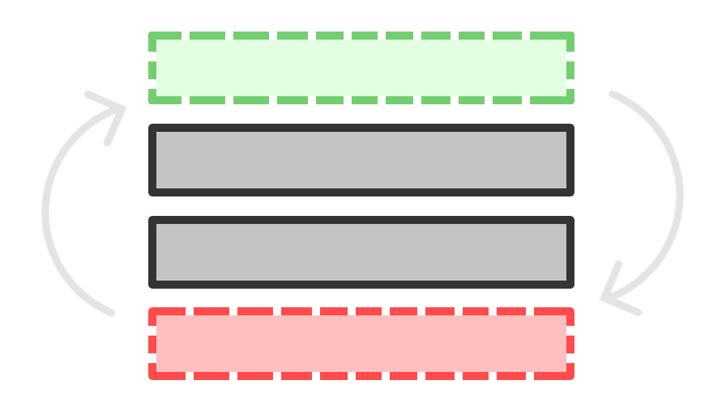

<a href="./README.md"></a>
<a href="./README.ru.md"></a>
<p align="center">
    
</p>
<h3 align="center">UIS</h3>
<h4 align="center">Бесконечный Unity скроллер для ScrollRect компонента</h4>
<p align="center">
    <a href="#быстрый-старт">Быстрый старт</a> · <a href="/Documentation~/index.md">Документация</a> · <a href="https://github.com/mopsicus/uis/issues">Отчёт об ошибке</a>
</p>

# 💬 Описание

Этот скрипт позволяет использовать компонент `ScrollRect` как бесконечный скроллер. Это быстрый, простой и удобный для мобильных UI, способ создания прокручивающихся списков с сотнями элементов, без задержек и рывков.

### Проблема

В Unity вы можете использовать компонент `ScrollRect` для прокрутки множества объектов UI. Но когда внутри списка прокрутки содержится много объектов, он начинает работать с рывками, анимация прокрутки становится не плавная.

### Решение

Этот скрипт использует data-driven подход для прокрутки и отображения элементов списка. Это означает что данные для отображения, а также ширина/высота элементов, хранятся отдельно от отображаемых объектов. Скрипт создаёт и показывает только те элементы которые помещаются на экране. Когда вы прокручиваете такой список, то элемент который пропадает с экрана, перемещается и появляется с другой стороны.

# ✨ Особенности

- быстрый, простой и удобный для мобильных UI
- элементы списка полностью настраиваемые
- диманические, data-driven списки
- эффективное повторное использование элементов списка
- функция `pull-to-refresh`
- функция `scroll-to`
- поддержка элементов с разной высотой/шириной

# 🚀 Использование

### Установка

Скачайте пакет со страницы [релизов](https://github.com/mopsicus/uis/releases) или добавьте строчку ниже в ваш файл `Packages/manifest.json` и пакет будет установлен по адресу Git репозитория:

```
"com.mopsicus.uis": "https://github.com/mopsicus/uis.git",
```

### Быстрый старт

Посмотрите пример использования в [демо](./Samples~/Demo). Это демо содержит 6 сцен с разными вариантами использования скроллера. Демо подскажет как инициализировать и использовать UIS в своём проекте, как использовать функцию `pull-to-refresh`, как работать со списками где элементы разной высоты или ширины.

_Протестировано в Unity 2020.3.x._

### Как начать использовать

1. Добавьте `UIS` в секцию `uses`
2. Добавьте `Scroll View` компонент на UI канвас
3. Добавьте скрипт `Scroller` к этом объекту
4. Настройте скрипт через инспектор
5. Добавьте обработчики и инициализируйте список

```csharp
using UIS;
using UnityEngine;

public class Demo : MonoBehaviour {

    [SerializeField]
    Scroller List = null;

    void Start() {
        List.OnFill += OnFillItem;
        List.OnHeight += OnHeightItem;
        List.InitData(100);
    }

    void OnFillItem(int index, GameObject item) {
        // возьмите данные для конкретного элемента
        // из вашей БД, JSON, и т.п.
        //
        // var data = jsonArray[index]; например
        //
        // примените данные к элементу списка
        //
        // item.GetComponent<ItemController>().Set(data);
    }

    int OnHeightItem(int index) {
        // возьмите данные о высоте конкретного элемента
        // из вашей БД, JSON, и т.п.
        //
        // или вычислите динамически
        //
        return 100;
    }
}
```

Описание всех функций читайте в [документации](Documentation~/index.md).


# 🏗️ Развитие

Мы приглашаем вас внести свой вклад и помочь улучшить UIS. Пожалуйста, ознакомьтесь с [документом](./CONTRIBUTING.md). 🤗

Вы также можете внести свой вклад в проект:

- Помогая другим пользователям
- Мониторя список существующих проблем
- Рассказав о проекте в своих соцсетях
- Используя его в своих проектах

### Настройка окружения

Настройте своё окружение для локальной разработки для удобства и "синхронизации" с текущим проектом. Так как UIS разрабатывается с использованием редактора VS Code, то все настройки и рекомендации предложены для него.

1. Используйте `Monokai Pro` или `eppz!` тему
2. Используйте `FiraCode` шрифт
3. Установите расширения:
    - C#
    - C# Dev Kit
    - Unity
4. Включите `Inlay Hints` в настройках C# расширения
5. Установить пакет `Visual Studio Editor` в редакторе Unity
6. Поместите файл `.editorconfig` в корневую папку проекта
7. Ура!

# 🤝 Поддержка

Вы можете поддержать проект любым из способов ниже:

* Bitcoin (BTC): 1VccPXdHeiUofzEj4hPfvVbdnzoKkX8TJ
* USDT (TRC20): TMHacMp461jHH2SHJQn8VkzCPNEMrFno7m
* TON: UQDVp346KxR6XxFeYc3ksZ_jOuYjztg7b4lEs6ulEWYmJb0f
* Карты Visa, Mastercard через [Boosty](https://boosty.to/mopsicus/donate)
* Карты МИР через [CloudTips](https://pay.cloudtips.ru/p/9f507669)

# ✉️ Контактная информация

Перед тем как задать вопрос, лучшим решением будет посмотреть уже существующие [проблемы](https://github.com/mopsicus/uis/issues), это может помочь. В любом случае, вы можете задать любой вопрос или отправить предложение по [email](mailto:mail@mopsicus.ru) или [Telegram](https://t.me/mopsicus).

# 🔑 Лицензия

UIS выпущен под лицензией [MIT](./LICENSE.md). Используйте бесплатно и радуйтесь. 🎉